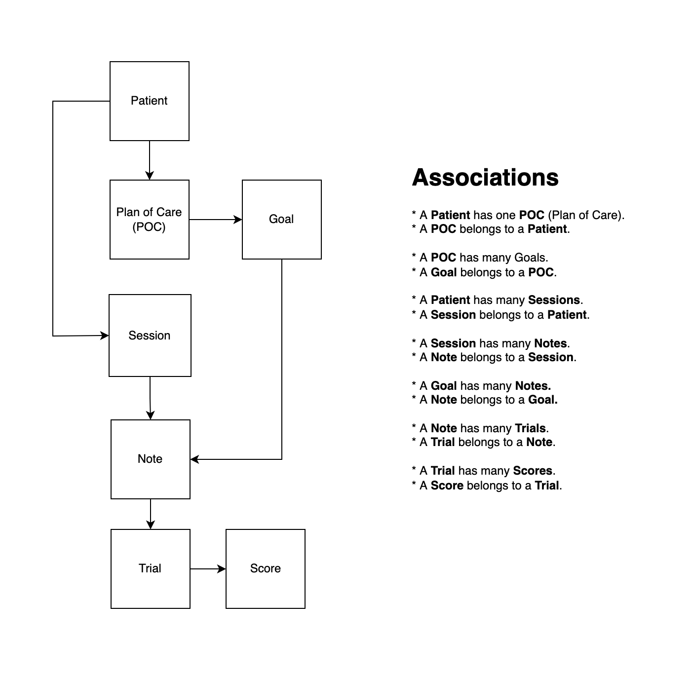
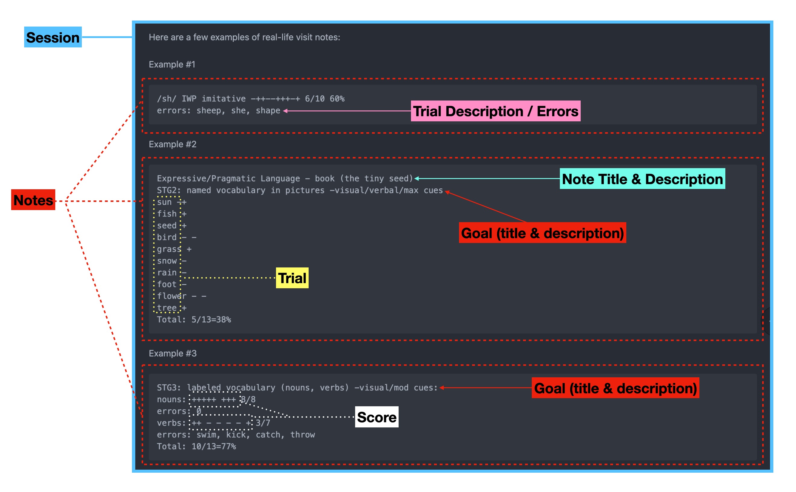

# Serenity Now Demo App

### Overview

After reading through the [spec](SPEC.md), I came up with two different approaches:

1. Take raw notes and parse them for structured entity extraction.
1. Have the user enter structured entities for us.

**Number One** 

This gives the user the most flexibility but is the most difficult for us in
assuring an always high quality experience for the user (they add new entities we
are already parsing, etc..).

**Number Two**

This gives us the ability to provide the most consistent, highest quality experience
for the user with the downside of putting the onus of doing something the user has
done for years in a new way.

**Approach Taken**

Based upon my previous experience with number one, and after a quick bit of searching 
for existing libraries / Gems (maybe I missed something?) I went with option number two.

In the past I've worked with extracting unstructured data from Resumes and attempting
to structure them. Lot's of hidden, time consuming issues.

### Object Model & Associations

Here is the Object Model and Associations I came up with based upon the spec and example
visit notes:

### Entities

You can see how I broke it all down from the examples provided. There was a bit of 
ambiguity with the spec and these examples, so I took my best "educated guess" for it.

For example, based upon my understanding it appears that a **Session** may have many
**Goals**, but each **Note** only contains 1 **Goal** (if any).

### Ambiguity

There was some ambiguity with the spec (for me) so I took the approach of 
"educated guesses" for this demo project.

In a real-world situation this is the point that I'd raise awareness and have a 
conversation with stakeholders and beyond.

### Live Demo App

I've deployed what I've finished within the time limit on a free Heroku account:

[Serenity Now Demo](https://serenity-now-demo.herokuapp.com)

Please understand that the Heroku free tier requires a warm-up period (handful of seconds)
if the application hasn't been used recently - hence the slow initial start.

### Code

* [Pull Request](https://github.com/ChrisDrit/serenity-now/pull/1) (feature work only)
* [Github Repo](https://github.com/ChrisDrit/serenity-now)

### Localhost

The only requirements are a Rails server and SQLite.

* [Getting started](https://guides.rubyonrails.org/getting_started.html#creating-a-new-rails-project-installing-rails)
* `rails db:create`
* `rails db:migrate`
* `rails s`

### Conclusion

**Stack**

* Rails 7.0.1
* Ruby 2.7.3 
* [SimpleCSS](https://simplecss.org)

**Things missing (due to time constraints)**

* Hotwire!!!!!
  * The idea behind me using Rails 7 was to get the default Hotwire goodness.
  * This would provide a more "reactive" UI / UX will still retaining a "Majestic Monolith"
  * I'm sad I didn't get to this 😡

* Finish the **Trial, Score** Entities
  * I didn't get to implementing the description / errors for each Trial.
  * I didn't get to the Scoring of each Trial.
  * I didn't get to the Totals for each Note.
  * I didn't get to any overall reporting on the Patients outcomes & progress.
  * I've mocked up the first three items listed, didn't get a chance to mockup the last.

* Automated testing
* Rubocop (linter)

* DRY'er code
* Better coding practices
* More thoughtful coding / architecture

* Better UI / UX
* Better undestanding (on my end):
  * Of the problems we are trying to solve for our users.
  * This understanding allows us to create an easier to use, and more enjoyable UI / UX for the user.
* Using form error handling and Object error handling versus the Flash messsaging (mostly) used. 
* Better error messaging.

* etc...

